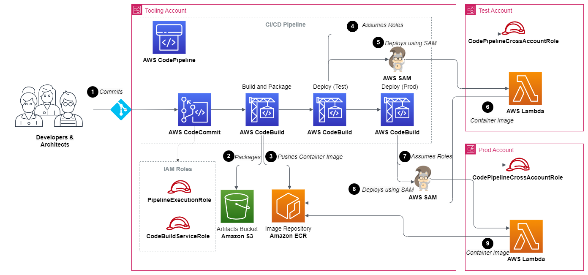

# Cross-account CI/CD for container-based Lambda

Many container-based workloads deploy through multiple environments. One container image is built and deployed to dev, and then promoted to staging and finally production. This is a reference implementation where pushing to a repository would trigger CI/CD that would build a lambda container image, deploy to a test account, followed by production AWS account.

## Requirements

* [Create an AWS account](https://portal.aws.amazon.com/gp/aws/developer/registration/index.html) if you do not already have one and log in. The IAM user that you use must have sufficient permissions to make necessary AWS service calls and manage AWS resources.
* [AWS CLI](https://docs.aws.amazon.com/cli/latest/userguide/install-cliv2.html) installed and configured
* [Git Installed](https://git-scm.com/book/en/v2/Getting-Started-Installing-Git)
* [AWS Serverless Application Model](https://docs.aws.amazon.com/serverless-application-model/latest/developerguide/serverless-sam-cli-install.html) (AWS SAM) installed
* Setup .aws/credentials [named profiles](https://docs.aws.amazon.com/cli/latest/userguide/cli-configure-profiles.html) for tooling, test and prod accounts so you can execute CLI and SAM commands against them.
* Set TOOLS_ACCOUNT_ID, TEST_ACCOUNT_ID, and PROD_ACCOUNT_ID env variables so they can be used by the scripts

We recommend using [AWS Cloud9](https://aws.amazon.com/cloud9/) to create an environment to get access to the AWS CLI and SAM CLI from a bash terminal. AWS Cloud9 is a browser-based IDE that provides a development environment in the cloud. While creating the new environment, ensure you choose Linux2 as the operating system. Alternatively, you can use your bash terminal in your favorite IDE and configure your AWS credentials in your terminal.

## Deployment Instructions

#### Create a Git Repository and push the code

Run the following command in **Tooling** account from your terminal to create a new CodeCommit repository.

    aws codecommit create-repository --repository-name lambda-container-repo --profile tooling

Initialize Git Repository and push the code.

    cd ~/environment/cicd-lambda-container
    git init -b main
    git add .
    git commit -m "Initial commit"
    git remote add origin codecommit://lambda-container-repo
    git push -u origin main

#### Create cross-account roles in Test and Prod accounts

In order for the pipeline to gain access to the test and production environment, it needs to assume an IAM role. In cross-account scenario, the IAM role for the pipeline must be created on the test and production accounts.

Change directory to the directory **templates** and run the following command to deploy roles to **Test** and **Prod** using respective named profiles.

**Test Profile**

    cd ~/environment/cicd-lambda-container/templates
    aws cloudformation deploy --template-file crossaccount_pipeline_roles.yml --stack-name codepipeline-crossaccount-roles --capabilities CAPABILITY_NAMED_IAM --profile test --parameter-overrides ToolAccountID=${TOOLS_ACCOUNT_ID}
    aws cloudformation describe-stacks --stack-name codepipeline-crossaccount-roles --query "Stacks[0].Outputs" --output json --profile test

Open *codepipeline_parameters.json* file from the root directory. Replace value of *TestCodePipelineCrossAccountRoleArn* and *TestCloudFormationCrossAccountRoleArn* with the CloudFormation output value of *CodePipelineCrossAccountRole* and *CloudFormationCrossAccountRole* respectively. 

**Prod Profile**

    aws cloudformation deploy --template-file crossaccount_pipeline_roles.yml --stack-name codepipeline-crossaccount-roles --capabilities CAPABILITY_NAMED_IAM --profile prod --parameter-overrides ToolAccountID=${TOOLS_ACCOUNT_ID}
    aws cloudformation describe-stacks --stack-name codepipeline-crossaccount-roles --query "Stacks[0].Outputs" --output json --profile prod

Open *codepipeline_parameters.json* file from the root directory. Replace value of *ProdCodePipelineCrossAccountRoleArn* and *ProdCloudFormationCrossAccountRoleArn* with the CloudFormation output value of *CodePipelineCrossAccountRole* and *CloudFormationCrossAccountRole* respectively. 

#### Create required IAM roles and infrastructure in Tooling account

Change directory to the directory **templates** and run the following command using **Tooling** named profile.

    aws cloudformation deploy --template-file tooling_resources.yml --stack-name tooling-resources --capabilities CAPABILITY_NAMED_IAM --parameter-overrides TestAccountID=${TEST_ACCOUNT_ID} ProdAccountID=${PROD_ACCOUNT_ID} --profile tooling
    aws cloudformation describe-stacks --stack-name tooling-resources --query "Stacks[0].Outputs" --output json --profile tooling   

Open *codepipeline_parameters.json* file from the root directory. Replace value of *ImageRepositoryURI*, *ArtifactsBucket*, *ToolingCodePipelineExecutionRoleArn*, and  *ToolingCloudFormationExecutionRoleArn* with the corresponding CloudFormation output value.

#### Update cross-account IAM roles

The cross-account IAM roles on the test and production account require permission to access artifacts that contain application code (S3 bucket and ECR repository). Note that the cross-account roles are deployed twice. This is because there is a circular dependency on the roles in the test and prod accounts and the pipeline artifact resources provisioned in the tooling account. The pipeline needs to reference and resolve the ARNs of the roles it needs to assume to deploy the application to the test and prod accounts, so the roles need to be deployed before the pipeline is provisioned. However, the policies attached to the roles need to include the S3 bucket and ECR respository. But the S3 bucket and ECR repository don't exist until the resources deploy in above step . So, we deploy the roles twice, once without a policy so their ARNs resolve, and a second time to attach policies to the existing roles that reference the resources in the tooling account. 

Replace *ImageRepositoryArn* and *ArtifactBucketArn* with output value from the above step in the below command and run it from the **templates** directory using **Test** and **Prod** named profiles. 

**Test Profile**

    aws cloudformation deploy --template-file crossaccount_pipeline_roles.yml --stack-name codepipeline-crossaccount-roles --capabilities CAPABILITY_NAMED_IAM --profile test --parameter-overrides ToolAccountID=${TOOLS_ACCOUNT_ID} ImageRepositoryArn=<ImageRepositoryArn value> ArtifactsBucketArn=<ArtifactsBucketArn value>

**Prod Profile**

    aws cloudformation deploy --template-file crossaccount_pipeline_roles.yml --stack-name codepipeline-crossaccount-roles --capabilities CAPABILITY_NAMED_IAM --profile prod --parameter-overrides ToolAccountID=${TOOLS_ACCOUNT_ID} ImageRepositoryArn=<ImageRepositoryArn value> ArtifactsBucketArn=<ArtifactsBucketArn value>

#### Deploy the pipeline

Replace *DeploymentRegion* value with the current region and *CodeCommitRepositoryName* value with the CodeCommit repository name in *codepipeline_parameters.json* file.

Push the changes to CodeCommit repository using Git commands.

Replace *CodeCommitRepositoryName* value with the CodeCommit repository name created in the first step and run the following command from the root directory of the project using **tooling** named profile.

    sam deploy -t codepipeline.yaml --stack-name cicd-lambda-container-pipeline --capabilities=CAPABILITY_IAM --parameter-overrides CodeCommitRepositoryName=<CodeCommit Repository Name> --profile tooling

## Clean Up

Run the following command in root directory of the project to delete the pipeline.

    sam delete --stack-name cicd-lambda-container-pipeline --profile tooling

Empty artifacts bucket. Replace Artifacts bucket name with the output value from the above step.

    aws s3 rm s3://<Arifacts bucket name> --recursive  --profile tooling

Delete Lambda functions from the test and prod.

    aws cloudformation delete-stack --stack-name lambda-container-app-test --profile test
    aws cloudformation delete-stack --stack-name lambda-container-app-prod --profile prod    

Delete cross-account roles from the test and prod.

    aws cloudformation delete-stack --stack-name codepipeline-crossaccount-roles --profile test
    aws cloudformation delete-stack --stack-name codepipeline-crossaccount-roles --profile prod
  
Delete the ECR repository.

    aws ecr delete-repository --repository-name image-repository --profile tooling --force 

Delete resources from the **tooling** account.

    aws cloudformation delete-stack --stack-name tooling-resources --profile tooling

## Security

See [CONTRIBUTING](CONTRIBUTING.md#security-issue-notifications) for more information.

## License

This library is licensed under the MIT-0 License. See the LICENSE file.

